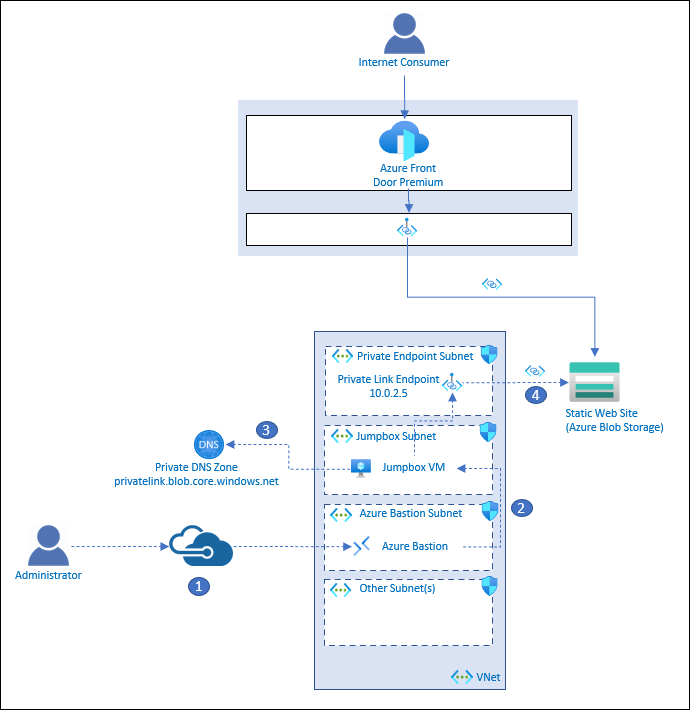
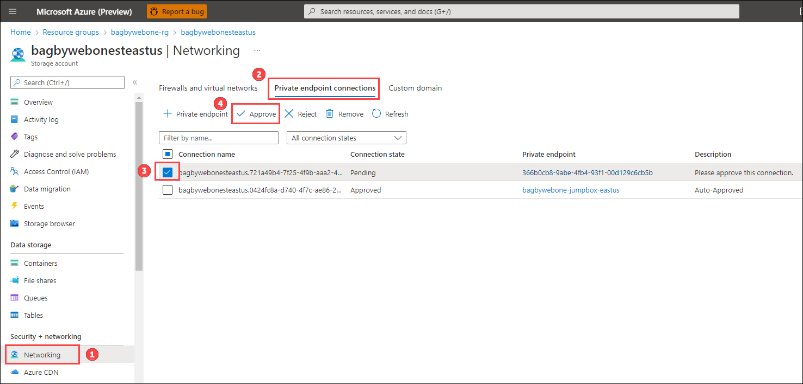

# Network secure global ingress with Azure Front Door Premium

The goal of this sample is to illustrate network-secure global routing with Azure Front Door. The sample uses Azure Storage Accounts with static html files to simulate workloads running in multiple regions.

## Features

You can either deploy the Standard or Premium version of Azure Front Door.

### Azure Front Door Standard


The Azure Front Door Standard deployment illustrates global routing without securing the workloads from a network perspective. The following resources are deployed:

- Azure Storage Accounts (specified by the storageAccountWebsiteLocations array parameter)
- Azure Front Door Standard

The storage accounts will be added as origins to Front Door.

Once the deployment is complete, you will need to add an "index.html" file to the web blob container in each Storage Account. The deployment does an Azure Role Based Access Control (RBAC) role assignment of "Storage Blob Data Contributor" for the supplied principalId parameter. The id should be for the logged in user. The Storage Accounts are not locked down from a network perspective, so you can copy index.html files to each Storage Account. You will find the commands in the instructions below.

### Azure Front Door Premium


If you choose to deploy Azure Front Door premium tier, private endpoint connection requests will be created from Azure Front Door Premium to each storage account. Further, the storage accounts will be configured to only be accessible from selected virtual networks and IP addresses, with no virtual networks specified. This effectively locks down the storage accounts.

All requests will flow through Azure Front Door. Azure Front Door will connect to the Azure Storage Accounts through the Microsoft Backbone network via Private Link.

### Virtual Network for Azure Front Door Premium



Because the storage accounts are locked down, the sample also allows you to deploy an Azure Virtual Network with Azure Bastion and a Jumpbox Virtual Machine. Private endpoint connections are made to the storage account in the Virtual Network. This will allow you to interact with the Storage Accounts from the Jumpbox.

Again, all requests will flow through Azure Front Door and Azure Front Door will connect to the Azure Storage Accounts through the Microsoft Backbone network via Private Link.

This deployment illustrates how an administrator could connect to a jumpbox virtual machine via Azure Bastion to perform any (emergency) administrative tasks. The following resources are deployed:

- Azure Virtual Network with 5 subnets:
  - WorkloadSubnet
  - PrivateEndpointsSubnet
  - JumpboxSubnet
  - AzureBastionSubnet
- Jumpbox Virtual Machine
- Azure Bastion
- Private endpoints that connect to each storage account
- Private DNS Zone - configured with A records for the private endpoint URLs to the storage accounts

The following describes the administrative flow:

1. An administrator connects to Azure Bastion that is deployed in the Virtual Network.
2. Azure Bastion provides SSH connectivity to the jumpbox virtual machine.
3. The administrator on the jumpbox tries to access the storage account via the Azure CLI. The jumpbox queries DNS for the public Azure Blob Storage Account endpoint: storageaccountname.blob.core.windows.net. Private DNS ultimately resolves to storageaccountname.privatelink.blob.core.windows.net, returning the private IP address of the private link endpoint which is 10.0.2.5 in this example.
4. A private connection to the storage account is established through the private link endpoint.

## Getting Started

**This sample assumes that there are no Azure Policies blocking aspects of the deployment. For example, many companies have a policy set to deny Azure Storage Accounts with public access. This sample uses publicly accessible Storage Accounts.**

### Prerequisites

- You will need to clone the repository
- A SSH key pair

### Clone or download this repository

From your shell or command line:

```bash
git clone https://github.com/RobBagby/network-secure-ingress-sample
cd network-secure-ingress-sample
```

### Creating SSH key pair

There are a variety of ways to create the SSH pey pair:

- [Generate and store SSH keys in the Azure portal](https://docs.microsoft.com/azure/virtual-machines/ssh-keys-portal)
- [Create and manage SSH keys locally](https://docs.microsoft.com/azure/virtual-machines/linux/create-ssh-keys-detailed)
- [Create and manage SSH Keys with the Azure CLI](https://docs.microsoft.com/azure/virtual-machines/ssh-keys-azure-cli)

### Installation

### Deploying Azure Front Door Standard

Use the following command to deploy the Azure Front Door Standard deployment. Make sure you are in the root directory of the repository you cloned and that you update the variables.

```bash
ASSET_PREFIX=<SetToAUniquePrefixBetween6and10characters>
FRONT_DOOR_SKU=Standard_AzureFrontDoor
LOCATION=centralus
PRINCIPAL_ID=$(az ad signed-in-user show --query id | tr -d '"')

az deployment sub create --template-file ./infra-as-code/bicep/deployRgFrontDoorAndWeb.bicep \
  --location $LOCATION \
  -p frontDoorSkuName=$FRONT_DOOR_SKU assetPrefix=$ASSET_PREFIX principalId=$PRINCIPAL_ID
```

### Deploying Azure Front Door Premium With Private Endpoints

Use the following command to deploy the Azure Front Door Premium deployment

```bash
ASSET_PREFIX=<SetToAUniquePrefixBetween6and12characters>
FRONT_DOOR_SKU=Premium_AzureFrontDoor
LOCATION=centralus
PRINCIPAL_ID=$(az ad signed-in-user show --query id | tr -d '"')

az deployment sub create --template-file ./infra-as-code/bicep/deployRgFrontDoorAndWeb.bicep \
  --location $LOCATION \
  -p frontDoorSkuName=$FRONT_DOOR_SKU assetPrefix=$ASSET_PREFIX principalId=$PRINCIPAL_ID
```

### Deploying the VNet for the Front Door Premium deployment

You will need to update the following parameters in parameters.json:

1. **jumpboxPublicSshKey** - Set this to the public SSH key you created earlier.
1. **storageAccountWebsiteLocations** - Set this to an array of valid Azure locations. Storage Accounts will be created in each location. The following is an example:

   ```json
       "storageAccountWebsiteLocations": {
      "value": [
        "eastus",
        "westus3"
      ]
    },
   ```

Use the following command to deploy the Virtual Network deployment

```bash
RESOURCE_GROUP=${ASSET_PREFIX}-rg

az deployment group create --template-file ./infra-as-code/bicep/deployVnet.bicep \
  --resource-group $RESOURCE_GROUP \
  --parameters @./infra-as-code/bicep/parameters.json 
  --parameters assetPrefix=$ASSET_PREFIX location=$LOCATION
```

**Note: The resourceGroupName should be the name of the resource group deployed in the Front Door Premium deployment.**<br />
**Note: You MUST make sure that the assetPrefix matches the assetPrefix used in the Front Door Premium deployment.**

## Adding index.html files to the websites

### Connecting to network secured Azure Storage Accounts

If you deployed the premium tier of Azure Front Door by setting the frontDoorSkuName parameter to 'Premium_AzureFrontDoor' when deploying 'deployRgFrontDoorAndWeb.bicep', the Azure Storage accounts will have public network access set to 'Enabled from selected virtual networks and IP addresses'. You will not be able to access the storage account without either:

1. [Configure Azure Storage firewalls and virtual networks](https://docs.microsoft.com/azure/storage/common/storage-network-security?tabs=azure-portal) to allow your client IP address. Open a shell.
2. [Deploy a VNet with a Jumpbox](#deploying-the-vnet-for-the-front-door-premium-deployment) and [Connect to the jumpbox](docs/ConnectToJumpbox.md)

### Log in to the Azure CLI

**Note: If you are using your own shell, you will have to make sure you have the [Azure CLI](https://docs.microsoft.com/cli/azure/install-azure-cli) installed.**

Perform the following steps:

1. [Log in to the Azure CLI](https://docs.microsoft.com/cli/azure/authenticate-azure-cli)
1. [Choose your subscription](https://docs.microsoft.com/cli/azure/manage-azure-subscriptions-azure-cli#change-the-active-subscription)

### Add the files via the CLI

**Note: The following commands can be used if you kept the default storage account locations. If you changed the locations, you will need to update the script with the locations you used.** <br/><br/>

Use the following commands to copy the sample web pages to your storage accounts:

```bash
ASSET_PREFIX=<SetToAUniquePrefixBetween6and12characters>
NAME_OF_WEST_STORAGE_ACCOUNT=${ASSET_PREFIX}stwestus3
NAME_OF_EAST_STORAGE_ACCOUNT=${ASSET_PREFIX}steastus

az storage blob copy start --account-name $NAME_OF_WEST_STORAGE_ACCOUNT --destination-blob index.html --auth-mode login --destination-container web --source-uri https://raw.githubusercontent.com/Azure-Samples/frontdoor-bicep-network-secure-global-ingress/main/sample-websites/west/index.html
az storage blob copy start --account-name $NAME_OF_EAST_STORAGE_ACCOUNT --destination-blob index.html --auth-mode login --destination-container web --source-uri https://raw.githubusercontent.com/Azure-Samples/frontdoor-bicep-network-secure-global-ingress/main/sample-websites/east/index.html
```

Use the following commands to validate that the web pages were copied to the storage accounts:

```bash
az storage blob list -c web --account-name $NAME_OF_WEST_STORAGE_ACCOUNT --auth-mode login -o table
az storage blob list -c web --account-name $NAME_OF_EAST_STORAGE_ACCOUNT --auth-mode login -o table
```

Note: You might need to set the content-type for the index.html files to "text/html". To do that, run the following commands.

```bash
az storage blob update --account-name $NAME_OF_WEST_STORAGE_ACCOUNT --container-name web --name index.html --content-type "text/html" --auth-mode login
az storage blob update --account-name $NAME_OF_EAST_STORAGE_ACCOUNT --container-name web --name index.html --content-type "text/html" --auth-mode login
```

## Approve the private endpoint requests

In the deployment, a private endpoint request was made from Azure Front Door to each Storage Account. **You need to approve each request.**  



To Approve the private endpoint request, open each Storage Account in the Azure Portal and perform the following steps:

1. Click on Networking.
1. Click on the Private endpoint connections tab.
1. Check the checkbox for the private endpoint connection request that has the Connection state of 'Pending'.
1. Click the 'Approve' button.
1. Confirm.


## Demo

To test the global routing:

1. Open your Azure Front Door instance in the Azure Portal.
1. Get the endpoint hostname from the Overview tab.
  
1. Append '/web/index.html' to the hostname and paste in a browser.
1. Refresh several times. You should see both 'East' and 'West' in the response.

  

## Clean up resources

```bash
az group delete --name <nameOfResourceGroup>
```

## Resources

TBD
