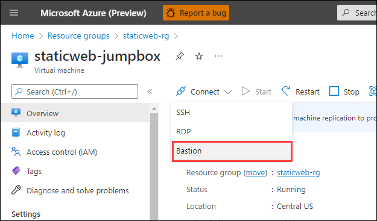
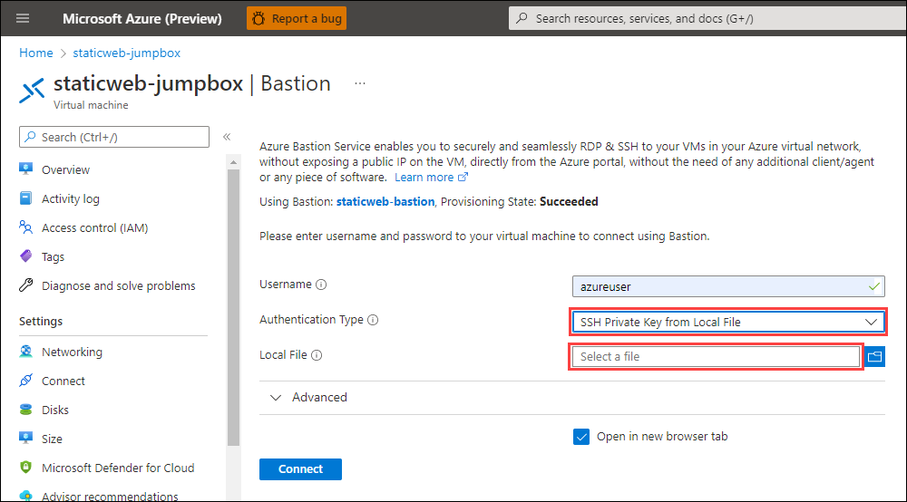

# Connect to the jumpbox via the Azure Portal

The easiest way to connect to a jumpbox virtual machine is through the Azure Portal. To connect, use the following steps:

1. Log in to the Azure Portal.
1. Click on your virtual machine.
1. Choose 'Connect' and 'Bastion' in the upper left hand corner.

    

1. Set the Authentication Type to SSH Private Key from Local File and choose the file holding the private SSH key you created.

    

1. Press Connect.